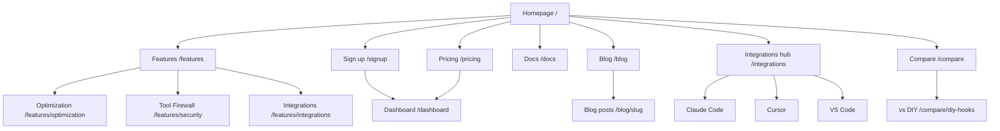

# Site Architecture — confire.dev

**Skill:** site-architecture  
**Site type:** Hybrid SaaS marketing + docs + blog  
**Primary goals:** Signup conversion, SEO, self-serve docs

---

## Page hierarchy

```
Homepage (/)
├── Product
│   ├── Features (/features)
│   │   ├── Context Optimization (/features/optimization)
│   │   ├── Tool Firewall (/features/security)
│   │   └── Integrations (/features/integrations)
│   ├── Pricing (/pricing)
│   └── Changelog (/changelog)
├── Integrations (/integrations)
│   ├── Claude Code (/integrations/claude-code)
│   ├── Cursor (/integrations/cursor)
│   └── VS Code (/integrations/vscode)
├── Resources
│   ├── Blog (/blog)
│   │   └── [posts] (/blog/{slug})
│   ├── Docs (/docs) → may redirect to docs.confire.dev
│   └── Compare (/compare)
│       └── vs DIY Hooks (/compare/diy-hooks)
├── Company
│   ├── About (/about)
│   └── Security (/security) — trust page, not product firewall
├── Legal
│   ├── Privacy (/privacy)
│   └── Terms (/terms)
└── App
    ├── Sign up (/signup)
    ├── Login (/login)
    └── Dashboard (/dashboard) — authenticated
```

---

## Visual sitemap (Mermaid)



---

## URL map

| Page | URL | Parent | Nav | Priority |
|------|-----|--------|-----|----------|
| Homepage | `/` | — | Header | High |
| Features | `/features` | Home | Header | High |
| Tool Firewall | `/features/security` | Features | Header dropdown | High |
| Optimization | `/features/optimization` | Features | Header dropdown | High |
| Pricing | `/pricing` | Home | Header | High |
| Docs | `/docs` | Home | Header | High |
| Blog | `/blog` | Home | Header | Medium |
| Claude Code | `/integrations/claude-code` | Integrations | Footer | Medium |
| Cursor | `/integrations/cursor` | Integrations | Footer | Medium |
| VS Code | `/integrations/vscode` | Integrations | Footer | Medium |
| Compare | `/compare/diy-hooks` | Compare | Footer | Medium |
| Changelog | `/changelog` | Home | Footer | Low |
| Dashboard | `/dashboard` | — | App | Auth only |
| Sign up | `/signup` | — | Header CTA | High |
| Privacy | `/privacy` | Legal | Footer | Low |
| Terms | `/terms` | Legal | Footer | Low |
| Security (trust) | `/security` | Company | Footer | Medium |

---

## Navigation spec

### Header (6 items + CTA)

1. Features (dropdown: Optimization, Tool Firewall, Integrations)
2. Pricing
3. Docs
4. Blog
5. Login (text link)
6. **Get started free** (button → `/signup`)

### Footer

| Column | Links |
|--------|-------|
| Product | Features, Pricing, Changelog, Dashboard |
| Integrations | Claude Code, Cursor, VS Code |
| Resources | Docs, Blog, Compare |
| Company | About, Security, Contact |
| Legal | Privacy, Terms |

### Breadcrumbs

Implement on all pages L2+:
`Home > Features > Tool Firewall`

Use BreadcrumbList schema.

---

## Internal linking plan

### Hub pages

| Hub | Spokes |
|-----|--------|
| `/features/security` | Blog: agent security, firewall modes, docs firewall reference |
| `/features/optimization` | Blog: token cost, bash compression, MCP optimizers |
| `/integrations/claude-code` | Docs quickstart, blog hooks post |
| `/pricing` | All feature pages, compare page |

### Cross-section links

| From | To | Anchor text |
|------|-----|-------------|
| Blog hooks post | `/features/security` | built-in tool firewall |
| Blog cost post | `/pricing` | free tier includes 500 optimizations |
| Features optimization | `/pricing` | MCP optimizers on Developer |
| Features security | `/pricing` | custom rules on Developer |
| Every blog post | `/signup` | Get started free |

### Orphan prevention

- [ ] Every integration page links from homepage features section
- [ ] `/compare/*` linked from pricing FAQ
- [ ] Changelog linked from footer only — add link from dashboard

---

## SEO / IA notes

- **Flat URLs** for blog: `/blog/{slug}` not `/blog/2026/06/slug`
- **Docs:** Consider `docs.confire.dev` subdomain — if split, 301 strategy required
- **llms.txt** at root — see ai-seo.md
- **No dates in URLs**

---

## v1 minimum viable site (launch)

**Must ship:**
- `/`, `/features`, `/features/security`, `/pricing`, `/docs`, `/signup`, `/login`, `/privacy`, `/terms`

**Ship within 30 days post-launch:**
- `/blog` + 2 posts
- `/integrations/claude-code`, `/integrations/cursor`, `/integrations/vscode`
- `/compare/diy-hooks`

**Defer:**
- `/about`, `/security` (trust), case studies, `/customers`

---

## Redirects (if migrating)

| Old | New |
|-----|-----|
| Any Cline-specific URLs | `/integrations` hub |
| `/features` anchor-only | Keep; add child pages |

---

## Schema recommendations

| Page | Schema type |
|------|-------------|
| Homepage | SoftwareApplication, Organization |
| Pricing | FAQPage |
| Features/security | FAQPage, HowTo |
| Blog posts | Article, FAQPage where applicable |
| All L2+ | BreadcrumbList |

See ai-seo.md for extractability checklist per page.
